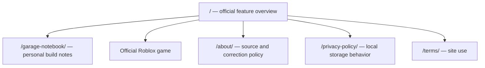

# Create a Car — scoped repair plan

Prepared 2026-10-08 by Codex agent. Official identity: Roblox place 134772864249515, universe 9903605866, AssemblerX. Public API and official page agree. API reports active players; released alpha is distinct from an unreleased private game.

P0 task: open the correct game, record a frame/engine/wheels setup and a player's own observations, then compare saved notes after a change. The notebook is not a game simulator and supplies no invented stats, preset best build, reward amount or profit formula.

| Route | Intent | Primary information | Main action | Failure fallback |
|---|---|---|---|---|
| / | Find the real game and its documented activities | Official feature summary, creator, explicit unknown numerical mechanics | Open Roblox or notebook | Official source link; no game API needed at runtime |
| /garage-notebook/ | Preserve player observations across builds | User-entered setup and results, explicit local-only storage | Save, compare, delete, export notes | Blank-form validation; visible storage/corrupt-data/export errors; session notes retained if save fails |
| /about/ | Understand the publisher and sources | Hlele attribution, actual agent review boundary, correction contact | View official source or send correction | No promise of response time |
| /privacy-policy/ | Understand actual data handling | Local storage, download and external links | Clear notes using notebook | No unsupported compliance certification |
| /terms/ | Understand site's scope | Independent site and personal notes limitations | Return to overview | Contact link |

Each of the eight invented archetype detail routes and the unsupported codes/calculator/best-build/beginner/parts/conveyor/dealer/merge/updates routes is retired as a genuine 404, removed from internal navigation and sitemap. No blanket redirect to home. Removed files are preserved under quality/archive/pre-scope-repair with a manifest. Existing original backups also remain outside this project. Source media with unclear provenance is removed from rendered pages; the design uses ordinary CSS rather than presenting illustrations as gameplay.

Indexable: / and /garage-notebook/. About and policy pages are noindex, follow. Sitemap has no artificial lastmod dates. Run production export, interaction/error tests, four-width visual review and factual registry before the release gate.
